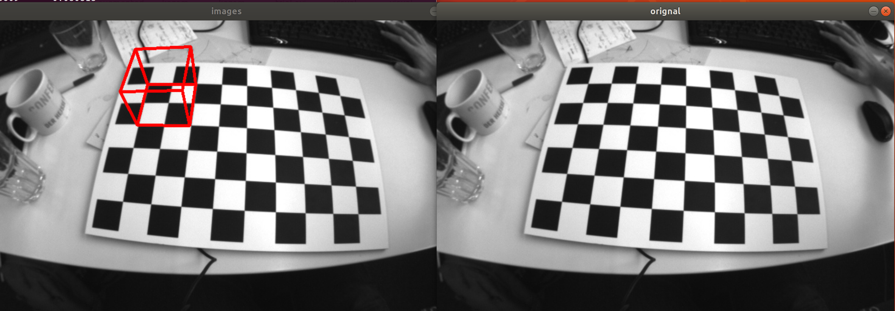

# Augmented-Reality-Wireframe-Cube

Drawing a wireframe cube on the intersections checker board using OpenCV, and Eigen in C++.

<figure>
 
 <figcaption>
 <p></p> 
 </figcaption>
</figure>


## Algorithm
```
1. Read an image In.
2. Initialize the cube coods in World Frame.
3. Use Rodrigues' rotation formula to get the rotation matrix.
4. Project the  points cube in the image frame, using perspective projection.
5. Distort the points using the radial distortion equation.
6. Connect the points to form a cube.
```

## Dependencies

* `OpenCV `
* `CMake`
* `Eigen3.3

## Run Instructions
```
mkdir build
cd build && cmake ..
make 
cd ../bin && ./main
```


## References
```
1.http://rpg.ifi.uzh.ch/teaching.html
```

## Links
https://youtu.be/vvhorL5e9rs
